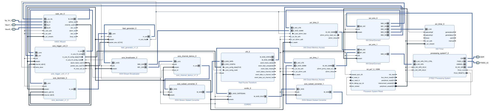

# HW XADC DMA Overlays

[](https://cern.ch/hog)
[](https://tul.com.tw/ProductsPYNQ-Z2.html)
[](https://www.xilinx.com)
[](https://github.com/SiririComun/hw-xadc-dma-overlays/releases/tag/v1.4.5)

A multi-regime hardware overlay for the **PYNQ-Z2** (`xc7z020clg400-1`) that captures simultaneous dual-channel analog signals using the XADC continuous sequencer, provides **FPGA-accelerated programmable anti-aliasing decimation ($M \in \{1, 10, 20, 50\}$)**, dynamic packetization, **runtime-reconfigurable 2048-point FFT ($N \in \{512, 1024, 2048\}$)**, and streams data directly to DDR memory via dual AXI DMA engines.

Managed using **Hog (HDL on Git)** for strict design traceability and automated bitstream versioning.

---

## 🏛 Hardware Architecture & Memory Map

The design captures analog data across **Arduino Header A0 (`Vaux1`)** and **A1 (`Vaux9`)**, gates frames via `axis_trigger_unit` with **selectable trigger source (A0 vs A1)**, applies runtime decimation via `axis_decimator`, packetizes frames with programmable `tlast_generator`, forks the stream via `axis_broadcaster`, computes the real-time Fourier transform via runtime-configurable `xfft` ($N=512, 1024, 2048$) and `cordic`, and transfers both Time and Frequency frames concurrently to DDR memory.

### Block Design Schematic


### Dataflow Diagram
```
                     [ PYNQ-Z2 Header A0 (Vaux1) ]       [ PYNQ-Z2 Header A1 (Vaux9) ]
                                   │                                   │
                                   └───────────────┬───────────────────┘
                                                   ▼
                                  [ XADC Wizard Dual Continuous Sequencer ]
                                                   │ (1 MSPS Interleaved Stream)
                                                   ▼
                                         [ axis_trigger_unit ]
                                         (Selectable Trigger: A0/A1, Phase-Locked to A0)
                                                   │ (Gated Stream)
                                                   ▼
                                         [ axis_decimator IP ]
                               (Programmable M = 1, 10, 20, 50 via Reg 0x14)
                                                   │
                                                   ▼
                                          [ tlast_generator ]
                               (Programmable Packet Limit via Reg 0x1C)
                                                   │ (w/ TLAST)
                                         [ axis_broadcaster ]
                                  ┌────────────────┴────────────────┐
                         (Time Stream w/ TLAST)            (Signed 32-bit Stream w/ DC Block)
                                  │                                 ▼
                                  │                    [ xfft Core (Runtime N FFT) ]
                                  │                    (N = 512, 1024, 2048 via Reg 0x18)
                                  │                                 │ (Complex Re + j*Im)
                                  │                                 ▼
                                  │                    [ CORDIC IP (Translate Mode) ]
                                  │                                 │ (16-bit Magnitude)
                                  ▼                                 ▼
                        [ AXI DMA 0 (Time) ]              [ AXI DMA 1 (FFT Mag) ]
                           (0x40400000)                      (0x40410000)
                                  │                                 │
                                  └────────────────┬────────────────┘
                                                   ▼ (AXI SmartConnect HP0)
                                        [ Processing System DDR ]
```

### Physical Pin Constraints (Arduino Header `J1`)

| Signal Port | Physical Pin | Header Location | Description |
| :--- | :--- | :--- | :--- |
| `Vaux1_0_v_p` / `v_n` | `E17` / `D18` | **Header `J1` Pin A0** (Pin 6 - Bottom) | Channel 1 Analog Differential Pair |
| `Vaux9_0_v_p` / `v_n` | `E18` / `E19` | **Header `J1` Pin A1** (Pin 5 - 2nd from Bottom) | Channel 2 Analog Differential Pair |

### AXI Memory Address Table

| Peripheral Block | Interface | Base Address | Address Range | Description |
| :--- | :--- | :--- | :--- | :--- |
| **AXI DMA Time** (`axi_dma_0`) | `S_AXI_LITE` | `0x40400000` | 64K | Time-Domain DMA Controller (Programmable sample frames) |
| **AXI DMA FFT** (`axi_dma_1`) | `S_AXI_LITE` | `0x40410000` | 64K | Frequency-Domain Magnitude DMA Controller ($N/2$ bins) |
| **AXI Timer** (`axi_timer_0`) | `S_AXI` | `0x42800000` | 64K | System Timer / Hardware Capture Trigger |
| **XADC Wizard** (`xadc_wiz_0`) | `s_axi_lite` | `0x43C00000` | 64K | XADC DRP & Continuous Sequencer Configuration |
| **AXIS Trigger Unit** (`axis_trigger_unit_0`) | `s_axi` | `0x43C10000` | 64K | Trigger, Decimation ($M$), FFT Length ($N$), & Packet Limits |

### Register Map (`axis_trigger_unit_0` @ `0x43C10000`)
* **`0x00: CONTROL_REG`** — `[0]`: Arm, `[1]`: Auto Mode, `[2]`: Falling Edge, `[3]`: Single Shot, `[4]`: Force, `[5]`: Trigger Source (`0=A0, 1=A1`)
* **`0x04: STATUS_REG`** — `[0]`: Armed, `[1]`: Triggered, `[2]`: Streaming
* **`0x08: THRESHOLD_REG`** — `[15:0]`: 12-bit left-aligned comparator threshold ($0.0\,\text{V} - 3.3\,\text{V}$)
* **`0x0C: TIMEOUT_REG`** — `[31:0]`: Auto-trigger timeout in clock cycles (Default: $5{,}000{,}000 = 50\,\text{ms}$)
* **`0x10: HYSTERESIS_REG`** — `[15:0]`: Noise rejection band
* **`0x14: DECIMATION_REG`** — `[1:0]`: `00` $\implies M=1$ (Bypass), `01` $\implies M=10$, `10` $\implies M=20$, `11` $\implies M=50$
* **`0x18: FFT_CONFIG_REG`** — `[15:0]`: `(NFFT << 8) | FWD_INV` (Pushes 16-bit word to `xfft_0` on write)
* **`0x1C: PACKET_SIZE_REG`** — `[15:0]`: Programmable sample count per DMA frame ($N$)

### Operating Regimes

| Profile Mode | Decimator ($M$) | Transform ($N$) | Sampling Rate ($f_s$) | Nyquist Bandwidth | Time Window ($T_{\text{win}}$) | Resolution ($\Delta f$) |
| :--- | :---: | :---: | :---: | :---: | :---: | :---: |
| **Wideband Lab Scope** | **$1$** | $2048$ | $500\,\text{kSPS}$ | $0 - 250\,\text{kHz}$ | $2.05\,\text{ms}$ | $244.14\,\text{Hz}$ |
| **Full-Band Audio** | **$10$** | $2048$ | $50\,\text{kSPS}$ | $0 - 25\,\text{kHz}$ | $40.96\,\text{ms}$ | $24.41\,\text{Hz}$ |
| **Speech / Vocal** | **$20$** | $2048$ | $25\,\text{kSPS}$ | $0 - 12.5\,\text{kHz}$ | $81.92\,\text{ms}$ | $12.21\,\text{Hz}$ |
| **Deep Bass Zoom** | **$50$** | $2048$ | $10\,\text{kSPS}$ | $0 - 5\,\text{kHz}$ | $204.80\,\text{ms}$ | **$4.88\,\text{Hz}$** |

---

## 📦 For Software Developers (Consuming this Overlay)

Specify the `v1.4.5` dependency in your `hardware.json`:

```json
{
  "repo": "SiririComun/hw-xadc-dma-overlays",
  "version": "v1.4.5",
  "overlay_name": "pynq_z2"
}
```

```python
from pynq_oscilloscope import OscilloscopeOverlay

ol = OscilloscopeOverlay()
ol.set_profile("audio")
app = ol.audio_dashboard()
```

---

## 🛠 For Firmware Developers (Building Locally)

```bash
git clone --recursive https://github.com/SiririComun/hw-xadc-dma-overlays.git
cd hw-xadc-dma-overlays
./Hog/Do CREATE pynq_z2
./Hog/Do WORK pynq_z2
```

---

## 📄 License

This project is licensed under the MIT License - see the [LICENSE](LICENSE) file for details.